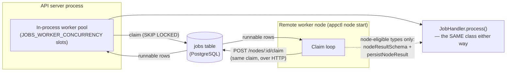

# System Architecture

**Web Application Foundation**
**Version:** 1.0
**Last Updated:** January 2026

This document provides a comprehensive architectural overview of this web application foundation, designed for AI-assisted development with specialized coding agents.

---

## Table of Contents

1. [Executive Summary](#1-executive-summary)
2. [System Overview](#2-system-overview)
3. [Architecture Principles](#3-architecture-principles)
4. [Technology Stack](#4-technology-stack)
5. [Component Architecture](#5-component-architecture)
6. [Data Architecture](#6-data-architecture)
7. [Security Architecture](#7-security-architecture)
8. [API Architecture](#8-api-architecture)
9. [Frontend Architecture](#9-frontend-architecture)
10. [Infrastructure Architecture](#10-infrastructure-architecture)
11. [Observability Architecture](#11-observability-architecture)
12. [Background Job Queue & Worker Fleet](#12-background-job-queue--worker-fleet)
13. [Testing Architecture](#13-testing-architecture)
14. [Agent-Based Development Model](#14-agent-based-development-model)
15. [Development Workflows](#15-development-workflows)
16. [Appendices](#16-appendices)

---

## 1. Executive Summary

### Purpose

This is a production-grade web application template that establishes:

- **Secure Authentication**: OAuth 2.0 with Google (extensible to other providers)
- **Fine-Grained Authorization**: Role-Based Access Control (RBAC) with permissions
- **Flexible Configuration**: JSONB-based settings framework for system and user preferences
- **Enterprise Observability**: OpenTelemetry instrumentation with traces, metrics, and structured logs
- **Agent-Friendly Development**: Modular architecture designed for AI coding agent collaboration

### Key Characteristics

| Aspect | Description |
|--------|-------------|
| **Architecture Style** | Monorepo with API-first design |
| **Hosting Model** | Same-origin (UI and API share base URL) |
| **Auth Strategy** | OAuth 2.0 + JWT with refresh token rotation |
| **Access Control** | Email allowlist + RBAC (Admin/Contributor/Viewer) |
| **Data Storage** | PostgreSQL with Prisma ORM |
| **Extensibility** | JSONB settings, modular NestJS structure |

### Target Audience

- **AI Coding Agents**: Primary consumers for automated development tasks
- **Backend Developers**: NestJS/Node.js engineers
- **Frontend Developers**: React/TypeScript engineers
- **DevOps Engineers**: Infrastructure and deployment specialists
- **Security Teams**: Security review and compliance

---

## 2. System Overview

### High-Level Architecture

```
┌─────────────────────────────────────────────────────────────────────────────┐
│                              NGINX REVERSE PROXY                             │
│                           (Security Headers, Routing)                        │
│                              http://localhost:3535                           │
├────────────────────────────────────┬────────────────────────────────────────┤
│         /* → Frontend (Web)        │           /api/* → Backend (API)       │
├────────────────────────────────────┼────────────────────────────────────────┤
│                                    │                                        │
│  ┌──────────────────────────────┐  │  ┌──────────────────────────────────┐  │
│  │       REACT FRONTEND         │  │  │       NESTJS + FASTIFY           │  │
│  │                              │  │  │                                  │  │
│  │  ┌────────────────────────┐  │  │  │  ┌────────────────────────────┐  │  │
│  │  │      Pages/Routes      │  │  │  │  │    Controllers/Guards      │  │  │
│  │  │  • Login               │  │  │  │  │  • AuthController          │  │  │
│  │  │  • Home                │  │  │  │  │  • UsersController         │  │  │
│  │  │  • User Settings       │  │  │  │  │  • SettingsController      │  │  │
│  │  │  • System Settings     │  │  │  │  │  • HealthController        │  │  │
│  │  │  • Device Activation   │  │  │  │  └────────────────────────────┘  │  │
│  │  └────────────────────────┘  │  │  │                                  │  │
│  │                              │  │  │  ┌────────────────────────────┐  │  │
│  │  ┌────────────────────────┐  │  │  │  │    Services/Business       │  │  │
│  │  │  Contexts/State        │  │  │  │  │    Logic Layer             │  │  │
│  │  │  • AuthContext         │  │  │  │  │  • AuthService             │  │  │
│  │  │  • ThemeContext        │  │  │  │  │  • UsersService            │  │  │
│  │  │  • SettingsContext     │  │  │  │  │  • SettingsService         │  │  │
│  │  └────────────────────────┘  │  │  │  │  • AllowlistService        │  │  │
│  │                              │  │  │  └────────────────────────────┘  │  │
│  │  ┌────────────────────────┐  │  │  │                                  │  │
│  │  │  Material UI (MUI)     │  │  │  │  ┌────────────────────────────┐  │  │
│  │  │  • Components          │  │  │  │  │    Prisma ORM              │  │  │
│  │  │  • Theming             │  │  │  │  │  • Database Access         │  │  │
│  │  │  • Responsive Design   │  │  │  │  │  • Query Building          │  │  │
│  │  └────────────────────────┘  │  │  │  │  • Migrations              │  │  │
│  │                              │  │  │  └────────────────────────────┘  │  │
│  └──────────────────────────────┘  │  └──────────────────────────────────┘  │
│                                    │                │                       │
│              Port 5173             │                │      Port 3000        │
└────────────────────────────────────┴────────────────┼───────────────────────┘
                                                      │
                                                      ▼
                                     ┌────────────────────────────────┐
                                     │        POSTGRESQL              │
                                     │                                │
                                     │  Tables:                       │
                                     │  • users, user_identities      │
                                     │  • roles, permissions          │
                                     │  • user_roles, role_permissions│
                                     │  • user_settings               │
                                     │  • system_settings             │
                                     │  • refresh_tokens              │
                                     │  • device_codes                │
                                     │  • allowed_emails              │
                                     │  • audit_events                │
                                     │                                │
                                     │           Port 5432            │
                                     └────────────────────────────────┘
                                                      │
                                                      ▼
                                     ┌────────────────────────────────┐
                                     │    OBSERVABILITY STACK         │
                                     │                                │
                                     │  • OTEL Collector              │
                                     │  • Uptrace (Traces/Metrics)    │
                                     │  • ClickHouse (Storage)        │
                                     │                                │
                                     │        Port 14318 (UI)         │
                                     └────────────────────────────────┘
```

### Request Flow

```
┌──────┐    ┌───────┐    ┌─────────────┐    ┌──────────────┐    ┌────────────┐
│Client│───▶│ Nginx │───▶│ JwtAuthGuard│───▶│ RolesGuard   │───▶│ Controller │
└──────┘    └───────┘    └─────────────┘    └──────────────┘    └────────────┘
                              │                    │                   │
                              ▼                    ▼                   ▼
                         Validate JWT       Check Roles/        Business Logic
                         Load User          Permissions         Response
```

---

## 3. Architecture Principles

### 3.1 Separation of Concerns

| Layer | Responsibility | Location |
|-------|---------------|----------|
| **Presentation** | User interaction, rendering, UX | `apps/web/` |
| **API Gateway** | HTTP handling, validation, auth | `apps/api/src/*/controllers/` |
| **Business Logic** | Domain rules, orchestration | `apps/api/src/*/services/` |
| **Data Access** | Database operations, queries | Prisma via services |
| **Infrastructure** | Routing, containers, config | `infra/` |

**Rule**: Frontend handles presentation only. All business logic resides in the API.

### 3.2 Same-Origin Hosting

All components served from the same base URL via Nginx reverse proxy:

| Path | Component | Purpose |
|------|-----------|---------|
| `/` | Frontend (React) | User interface |
| `/api/*` | Backend (NestJS) | REST API |
| `/api/docs` | Scalar API reference | Interactive API documentation |
| `/api/openapi.json` | OpenAPI spec | Machine-readable API schema |

**Benefits**: No CORS complexity, simplified cookie handling, unified deployment.

### 3.3 Security by Default

- **Authentication Required**: All API endpoints require JWT unless explicitly marked `@Public()`
- **Authorization Enforced**: RBAC guards verify roles/permissions before controller execution
- **Input Validated**: Zod schemas validate all request payloads
- **Secrets Protected**: Environment variables only, never committed to source

### 3.4 API-First Design

- **Contract-Driven**: OpenAPI specification generated from code annotations
- **Versioned**: API paths support future versioning (`/api/v1/`)
- **Consistent**: Standardized response format for success and errors
- **Documented**: Every endpoint documented with OpenAPI decorators; the published
  document is assembled in `apps/api/src/openapi/` and linted by Spectral in CI
  (see [API.md § How the document is built](API.md#how-the-document-is-built))

### 3.5 Observable by Design

- **Traced**: OpenTelemetry auto-instrumentation for all HTTP and DB operations
- **Metered**: Request counts, durations, error rates exposed as metrics
- **Logged**: Structured JSON logging with correlation IDs
- **Health-Checked**: Liveness and readiness endpoints for orchestration

---

## 4. Technology Stack

### 4.1 Core Technologies

| Component | Technology | Version | Purpose |
|-----------|------------|---------|---------|
| **Runtime** | Node.js | 24+ (LTS) | Server runtime |
| **Language** | TypeScript | 6.x | Type safety |
| **Backend Framework** | NestJS | 11.x | API structure |
| **HTTP Adapter** | Fastify | 5.x | High-performance HTTP |
| **Frontend Framework** | React | 19.x | UI rendering |
| **UI Library** | Material UI (MUI) | 9.x | Component library |
| **Database** | PostgreSQL | 16+ | Data persistence |
| **ORM** | Prisma | 7.x | Database access |

### 4.2 Authentication & Security

| Component | Technology | Purpose |
|-----------|------------|---------|
| **OAuth Strategy** | Passport.js | OAuth flow handling |
| **OAuth Provider** | Google OAuth 2.0 | Primary identity provider |
| **Token Format** | JWT (HS256) | Stateless authentication |
| **Validation** | Zod | Runtime schema validation |
| **Security Headers** | Helmet (via Nginx) | HTTP security headers |

### 4.3 Infrastructure

| Component | Technology | Purpose |
|-----------|------------|---------|
| **Containerization** | Docker | Application packaging |
| **Orchestration** | Docker Compose | Local development environment |
| **Reverse Proxy** | Nginx | Routing, SSL termination, headers |
| **Observability** | OpenTelemetry + Uptrace | Traces, metrics, logs |
| **Logging** | Pino | Structured JSON logging |

### 4.4 Testing

| Component | Technology | Purpose |
|-----------|------------|---------|
| **Backend Unit Tests** | Jest + jest-mock-extended | Service/guard testing with mocked Prisma |
| **Backend Integration** | Jest + Supertest | HTTP endpoint testing with mocked database |
| **Prisma Mocking** | jest-mock-extended (DeepMockProxy) | Type-safe database mocking |
| **Frontend Tests** | Vitest + React Testing Library | Component and context testing |
| **Frontend API Mocking** | MSW (Mock Service Worker) | Network request interception |
| **E2E (Optional)** | Playwright | Full system testing |

**Key Testing Characteristics:**
- Backend tests use **mocked PrismaService** by default (no real database required)
- Integration tests verify full HTTP request/response cycle with mocked data layer
- Frontend tests run in jsdom environment with MSW intercepting API calls
- Coverage thresholds: 70% minimum for frontend (enforced in vitest.config.ts)

---

## 5. Component Architecture

### 5.1 Repository Structure

```
./
├── apps/
│   ├── api/                          # Backend API (NestJS + Fastify)
│   │   ├── src/
│   │   │   ├── auth/                 # Authentication module
│   │   │   │   ├── controllers/
│   │   │   │   ├── services/
│   │   │   │   ├── guards/
│   │   │   │   ├── strategies/
│   │   │   │   └── decorators/
│   │   │   ├── users/                # User management module
│   │   │   ├── settings/             # Settings module (user + system)
│   │   │   ├── allowlist/            # Email allowlist module
│   │   │   ├── health/               # Health check module
│   │   │   ├── prisma/               # Prisma service
│   │   │   ├── common/               # Shared utilities
│   │   │   │   ├── constants/
│   │   │   │   ├── filters/
│   │   │   │   └── interceptors/
│   │   │   ├── config/               # Configuration module
│   │   │   └── main.ts               # Application entry
│   │   ├── prisma/
│   │   │   ├── schema.prisma         # Database schema
│   │   │   ├── migrations/           # Migration history
│   │   │   └── seed.ts               # Database seeding
│   │   ├── test/                     # Integration tests
│   │   └── Dockerfile
│   │
│   └── web/                          # Frontend (React + MUI)
│       ├── src/
│       │   ├── components/           # Reusable UI components
│       │   ├── pages/                # Page components
│       │   ├── contexts/             # React context providers
│       │   ├── hooks/                # Custom hooks
│       │   ├── services/             # API client
│       │   ├── theme/                # MUI theme configuration
│       │   ├── types/                # TypeScript types
│       │   └── __tests__/            # Component tests
│       └── Dockerfile
│
├── docs/                             # Documentation
│   ├── ARCHITECTURE.md               # This document
│   ├── SECURITY-ARCHITECTURE.md      # Security details
│   ├── API.md                        # API reference
│   ├── DEVELOPMENT.md                # Development guide
│   ├── TESTING.md                    # Testing guide
│   ├── DEVICE-AUTH.md                # Device auth guide
│   └── specs/                        # Implementation specifications
│       ├── 01-project-setup.md
│       ├── 02-database-schema.md
│       └── ... (24 specs total)
│
├── infra/                            # Infrastructure configuration
│   ├── compose/
│   │   ├── base.compose.yml          # Core services
│   │   ├── dev.compose.yml           # Development overrides
│   │   ├── prod.compose.yml          # Production overrides
│   │   ├── otel.compose.yml          # Observability stack
│   │   └── .env.example              # Environment template
│   ├── nginx/
│   │   └── nginx.conf                # Reverse proxy config
│   └── otel/
│       ├── otel-collector-config.yaml
│       └── uptrace.yml
│
├── .claude/                          # AI agent configuration
│   └── agents/
│       ├── backend-dev.md            # Backend specialist
│       ├── frontend-dev.md           # Frontend specialist
│       ├── database-dev.md           # Database specialist
│       ├── testing-dev.md            # Testing specialist
│       └── docs-dev.md               # Documentation specialist
│
├── CLAUDE.md                         # AI assistant guidance
└── README.md                         # Project overview
```

### 5.2 Backend Module Structure

Each NestJS module follows a consistent pattern:

```
module-name/
├── module-name.module.ts         # Module definition
├── module-name.controller.ts     # HTTP endpoints
├── module-name.service.ts        # Business logic
├── dto/                          # Data Transfer Objects
│   ├── create-item.dto.ts
│   └── update-item.dto.ts
├── interfaces/                   # TypeScript interfaces
├── guards/                       # Module-specific guards
└── module-name.controller.spec.ts  # Unit tests
```

### 5.3 Frontend Component Structure

```
components/
├── ComponentName/
│   ├── ComponentName.tsx         # Component implementation
│   ├── ComponentName.test.tsx    # Component tests
│   └── index.ts                  # Barrel export

pages/
├── PageName/
│   ├── PageName.tsx              # Page component
│   ├── PageName.test.tsx         # Page tests
│   └── index.ts                  # Barrel export
```

### 5.4 Storage Subsystem

The storage system provides file upload and management capabilities with support for large files through resumable multipart uploads.

#### Architecture Overview

The storage system uses a provider abstraction pattern to support multiple cloud storage backends while maintaining a consistent API.

```
┌─────────────────────────────────────────────────────────────┐
│                    Storage Module                            │
├─────────────────────────────────────────────────────────────┤
│  Objects Controller                                          │
│  └── Upload/Download/CRUD endpoints                          │
├─────────────────────────────────────────────────────────────┤
│  Objects Service                                             │
│  └── Business logic, ownership validation                    │
├─────────────────────────────────────────────────────────────┤
│  Storage Provider Interface                                  │
│  ├── S3StorageProvider (implemented)                         │
│  └── AzureStorageProvider (future)                          │
├─────────────────────────────────────────────────────────────┤
│  Object Processing Pipeline                                  │
│  └── Async post-upload processing with pluggable processors  │
└─────────────────────────────────────────────────────────────┘
```

#### Upload Flow

**1. Resumable Upload (Large Files)**:
   - Client calls `/api/storage/objects/upload/init` with file metadata
   - Server creates DB record, initializes S3 multipart, returns presigned URLs
   - Client uploads parts directly to S3 (bypasses application server)
   - Client calls `/api/storage/objects/:id/upload/complete` with part ETags
   - Server finalizes upload with S3, triggers processing pipeline

**2. Simple Upload (Small Files < 100MB)**:
   - Client sends file via multipart/form-data to `/api/storage/objects`
   - Server streams directly to S3
   - Processing pipeline triggered on completion

#### Processing Pipeline

Post-upload processing is handled asynchronously via NestJS EventEmitter:

```
ObjectUploadedEvent (emitted)
         ↓
ObjectProcessingService (orchestrator)
         ↓
Registered Processors (run in priority order)
         ↓
Results aggregated into object metadata
         ↓
Status updated: ready | failed
```

**Key Features:**
- Pluggable processor architecture
- Priority-based execution order
- Processors run asynchronously (non-blocking)
- Results stored in object metadata JSONB field
- Extensible for future processing needs (virus scanning, image resizing, etc.)

#### Database Schema

**storage_objects**:
- File metadata, status, storage key
- Owner reference (user_id)
- Processing results in JSONB metadata field

**storage_object_chunks**:
- Tracks multipart upload progress
- Part number, ETag, upload status
- Enables resume capability

#### Module Structure

```
apps/api/src/storage/
├── storage.module.ts                # Module definition
├── objects/
│   ├── objects.controller.ts        # HTTP endpoints
│   ├── objects.service.ts           # Business logic
│   ├── dto/                         # Data transfer objects
│   └── interfaces/
├── providers/
│   ├── storage-provider.interface.ts
│   └── s3-storage.provider.ts
└── processing/
    ├── object-processing.service.ts
    └── processors/
        └── base-processor.interface.ts
```

---

## 6. Data Architecture

### 6.1 Entity Relationship Diagram

```
┌────────────────────┐       ┌────────────────────┐
│       users        │       │   user_identities  │
├────────────────────┤       ├────────────────────┤
│ id (PK, UUID)      │──┐    │ id (PK, UUID)      │
│ email (UNIQUE)     │  │    │ user_id (FK)       │──┘
│ display_name       │  └───▶│ provider           │
│ provider_display   │       │ provider_subject   │
│ profile_image_url  │       │ provider_email     │
│ provider_image_url │       │ created_at         │
│ is_active          │       └────────────────────┘
│ created_at         │
│ updated_at         │       ┌────────────────────┐
└────────────────────┘       │    user_settings   │
         │                   ├────────────────────┤
         │                   │ id (PK, UUID)      │
         │                   │ user_id (FK, UNIQUE)│◀─┐
         │                   │ value (JSONB)      │  │
         │                   │ version            │  │
         ▼                   │ updated_at         │  │
┌────────────────────┐       └────────────────────┘  │
│    user_roles      │                               │
├────────────────────┤                               │
│ user_id (FK, PK)   │───────────────────────────────┘
│ role_id (FK, PK)   │──┐
└────────────────────┘  │    ┌────────────────────┐
                        │    │       roles        │
                        │    ├────────────────────┤
                        └───▶│ id (PK, UUID)      │
                             │ name (UNIQUE)      │
                             │ description        │
                             └────────────────────┘
                                       │
                                       ▼
                             ┌────────────────────┐
                             │  role_permissions  │
                             ├────────────────────┤
                             │ role_id (FK, PK)   │
                             │ permission_id (PK) │──┐
                             └────────────────────┘  │
                                                     │
                             ┌────────────────────┐  │
                             │    permissions     │  │
                             ├────────────────────┤  │
                             │ id (PK, UUID)      │◀─┘
                             │ name (UNIQUE)      │
                             │ description        │
                             └────────────────────┘

┌────────────────────┐       ┌────────────────────┐
│  system_settings   │       │   refresh_tokens   │
├────────────────────┤       ├────────────────────┤
│ id (PK, UUID)      │       │ id (PK, UUID)      │
│ key (UNIQUE)       │       │ user_id (FK)       │
│ value (JSONB)      │       │ token_hash (UNIQUE)│
│ version            │       │ expires_at         │
│ updated_by_user_id │       │ created_at         │
│ updated_at         │       │ revoked_at         │
└────────────────────┘       └────────────────────┘

┌────────────────────┐       ┌────────────────────┐
│   allowed_emails   │       │    device_codes    │
├────────────────────┤       ├────────────────────┤
│ id (PK, UUID)      │       │ id (PK, UUID)      │
│ email (UNIQUE)     │       │ device_code_hash   │
│ added_by_id (FK)   │       │ user_code (UNIQUE) │
│ added_at           │       │ user_id (FK)       │
│ claimed_by_id (FK) │       │ client_info (JSONB)│
│ claimed_at         │       │ status             │
│ notes              │       │ expires_at         │
└────────────────────┘       │ last_polled_at     │
                             └────────────────────┘

┌────────────────────┐
│    audit_events    │
├────────────────────┤
│ id (PK, UUID)      │
│ actor_user_id (FK) │
│ action             │
│ target_type        │
│ target_id          │
│ meta (JSONB)       │
│ created_at         │
└────────────────────┘

┌────────────────────┐       ┌────────────────────────┐
│  storage_objects   │       │ storage_object_chunks  │
├────────────────────┤       ├────────────────────────┤
│ id (PK, UUID)      │──┐    │ id (PK, UUID)          │
│ owner_id (FK)      │  │    │ object_id (FK)         │──┘
│ name               │  └───▶│ part_number            │
│ size               │       │ e_tag                  │
│ mime_type          │       │ size                   │
│ storage_key        │       │ status                 │
│ storage_provider   │       │ created_at             │
│ upload_id          │       │ completed_at           │
│ status             │       └────────────────────────┘
│ metadata (JSONB)   │
│ created_at         │
│ updated_at         │
└────────────────────┘
```

### 6.2 JSONB Schema Definitions

#### User Settings Shape

```json
{
  "theme": "light | dark | system",
  "profile": {
    "displayName": "string | null",
    "imageSource": "none | provider | upload",
    "imageObjectId": "uuid | null"
  }
}
```

`imageSource` selects which picture represents the user (no picture, the OAuth
provider's picture, or one uploaded via `POST /api/user-settings/profile-image`);
`imageObjectId` is the uploaded avatar's storage object id, present only when
relevant. Rows written before this shape existed carry `useProviderImage`/
`customImageUrl` instead — normalized to the shape above on every read rather
than by a data migration (see `apps/api/src/common/profile-image/profile-image.ts`).

#### System Settings Shape

`system_settings.value` — the JSONB column itself — holds `notifications`,
`jobs`, `nodes`, `databaseBackup` and `maintenance`. (Two earlier namespaces,
`ui` and `features`, were removed by issue #366: nothing at runtime ever read
either one, so they were dropped from the schema, DTOs and seed rather than
kept as dead weight — see `docs/specs/settings-ui.md` for the settings-UI
side of that cleanup.)

```json
{
  "notifications": {
    "browserEnabled": true,
    "disabledEvents": []
  },
  "jobs": {
    "history": { "retentionDays": 30, "purgeEnabled": true },
    "stuckThresholdMinutes": 30
  },
  "nodes": {
    "staleHeartbeatSeconds": 90,
    "offlineStaleMultiplier": 4,
    "offlineRetentionDays": 30,
    "jobSecretBrokerEnabled": false
  },
  "databaseBackup": {
    "enabled": false,
    "frequency": "daily",
    "dayOfWeek": 0,
    "dayOfMonth": 1,
    "timeOfDay": "02:00",
    "timezone": "UTC",
    "retentionCount": 7,
    "storageProvider": "s3",
    "runStaleMinutes": 120,
    "compressionLevel": 6,
    "restoreRollbackMode": "retain_database",
    "oldDatabaseRetentionHours": 48,
    "nodeOffloadEnabled": false
  },
  "maintenance": {
    "enabled": false,
    "message": "This service is temporarily unavailable for scheduled maintenance. Please try again shortly.",
    "allowAdmins": true,
    "startedAt": null,
    "startedById": null
  }
}
```

`GET/PUT/PATCH /api/system-settings` project this stored row into
`SystemSettingsResponseDto`, which adds a `security` block on the way out —
see [`docs/API.md`](API.md#get-system-settings) for the full response shape.

`security` is derived, read-only configuration — `jwtAccessTtlMinutes` and
`refreshTtlDays` are read from the `JWT_ACCESS_TTL_MINUTES` /
`JWT_REFRESH_TTL_DAYS` environment variables via `ConfigService`, not from the
database. It is never written to `system_settings.value`: the write schemas
(`updateSystemSettingsSchema` / `patchSystemSettingsSchema`) don't declare it,
so a client that sends it has the key silently stripped by the global
`ZodValidationPipe` before the request reaches the settings service.

`notifications` (issue #225, epic #215) is a modelled block rather than an
entry in an open, untyped map — the now-removed `features` namespace was
exactly that shape (`z.record(z.string(), z.boolean())`, no schema, no
default, no place to document semantics, deliberately owned by downstream
forks for their own operational flags), and a framework-level,
security-adjacent gate like this one needs a real type, a real default, and
somewhere for its semantics to live. It is stored and editable as of #225, and
as of #226 it is enforced: `browserEnabled` and `disabledEvents` are read once
per dispatch by a new `NotificationPolicyService` and applied through
`notification-policy.ts`'s `policyChannels` and `isBrowserToastAllowed`
functions, consulted at three call sites — the dispatcher's channel
resolution, `GET /api/notifications/events`'s advertised channels, and the
SSE stream's `toast` field — so the matrix, the dispatch decision, and the
delivered toast can never disagree. Mandatory events (e.g.
`security.role_changed`) are the deliberate exception: their `notifications`
row is always written regardless of policy, since the row itself is the
record of a privilege or security change the user must not be able to make
disappear; only the browser toast is suppressed for them.

### 6.3 Database Design Principles

| Principle | Implementation |
|-----------|---------------|
| **UUID Primary Keys** | All tables use UUID v4 for primary keys |
| **Timestamptz** | All timestamps use `timestamptz` for timezone awareness |
| **JSONB for Flexibility** | Settings stored as JSONB for schema-less extensibility |
| **Cascade Deletes** | Foreign keys cascade on user deletion |
| **Soft Deletes** | Users deactivated via `is_active` flag, not hard deleted |
| **Audit Trail** | `audit_events` table logs all security-relevant actions |

---

## 7. Security Architecture

### 7.1 Authentication Flow

```
┌─────────┐          ┌─────────┐          ┌─────────┐          ┌─────────┐
│  User   │          │ Frontend│          │   API   │          │ Google  │
└────┬────┘          └────┬────┘          └────┬────┘          └────┬────┘
     │                    │                    │                    │
     │  1. Click Login    │                    │                    │
     │───────────────────▶│                    │                    │
     │                    │                    │                    │
     │                    │ 2. Redirect to     │                    │
     │                    │    /api/auth/google│                    │
     │                    │───────────────────▶│                    │
     │                    │                    │                    │
     │                    │                    │ 3. Redirect to     │
     │◀───────────────────┼────────────────────┼────────────────────│
     │                    │                    │    Google OAuth    │
     │                    │                    │                    │
     │  4. Grant Consent  │                    │                    │
     │────────────────────┼────────────────────┼───────────────────▶│
     │                    │                    │                    │
     │                    │                    │ 5. Callback with   │
     │                    │                    │◀───────────────────│
     │                    │                    │    auth code       │
     │                    │                    │                    │
     │                    │                    │ 6. Exchange code   │
     │                    │                    │    for tokens      │
     │                    │                    │───────────────────▶│
     │                    │                    │                    │
     │                    │                    │◀───────────────────│
     │                    │                    │    User profile    │
     │                    │                    │                    │
     │                    │                    │ 7. Check allowlist │
     │                    │                    │    Provision user  │
     │                    │                    │    Generate JWT    │
     │                    │                    │    Store refresh   │
     │                    │                    │                    │
     │                    │ 8. Redirect with   │                    │
     │                    │◀───────────────────│                    │
     │                    │    access token    │                    │
     │                    │    + refresh cookie│                    │
     │                    │                    │                    │
     │ 9. Authenticated   │                    │                    │
     │◀───────────────────│                    │                    │
     │                    │                    │                    │
```

### 7.2 Token Strategy

| Token Type | Storage (Client) | Storage (Server) | Lifetime | Purpose |
|------------|-----------------|------------------|----------|---------|
| **Access Token** | Memory only | None (stateless) | 15 min | API authorization |
| **Refresh Token** | HttpOnly cookie | SHA256 hash in DB | 14 days | Obtain new access tokens |

**Security Properties:**
- Access tokens never touch localStorage (XSS protection)
- Refresh tokens in HttpOnly cookies (JavaScript cannot access)
- Refresh token rotation on each use (reuse detection)
- Database allows server-side revocation

### 7.3 RBAC Model

```
                    ┌─────────────────────────────────────────────┐
                    │                 PERMISSIONS                  │
                    ├─────────────────────────────────────────────┤
                    │ system_settings:read  │ system_settings:write│
                    │ user_settings:read    │ user_settings:write  │
                    │ users:read            │ users:write          │
                    │ rbac:manage           │ allowlist:read       │
                    │ allowlist:write       │                      │
                    └────────────┬───────────┴──────────────────────┘
                                 │
        ┌────────────────────────┼────────────────────────┐
        │                        │                        │
        ▼                        ▼                        ▼
┌───────────────┐      ┌───────────────┐      ┌───────────────┐
│     ADMIN     │      │  CONTRIBUTOR  │      │    VIEWER     │
├───────────────┤      ├───────────────┤      ├───────────────┤
│ ALL           │      │ user_settings:│      │ user_settings:│
│ PERMISSIONS   │      │   read/write  │      │   read        │
│               │      │               │      │               │
│ (Full Access) │      │ (Standard     │      │ (Least        │
│               │      │  User)        │      │  Privilege)   │
└───────────────┘      └───────────────┘      └───────────────┘
        │                        │                        │
        └────────────────────────┼────────────────────────┘
                                 │
                                 ▼
                        ┌───────────────┐
                        │     USERS     │
                        │  (Many-to-Many│
                        │   Assignment) │
                        └───────────────┘
```

### 7.4 Access Control Layers

```
Request → Nginx → JwtAuthGuard → RolesGuard → PermissionsGuard → Controller
            │           │             │              │
            │           │             │              └── Check @Permissions()
            │           │             │                  AND logic (all required)
            │           │             │
            │           │             └── Check @Roles() decorator
            │           │                 OR logic (any role matches)
            │           │
            │           └── Validate JWT, load user+roles+permissions
            │               Check user is active
            │
            └── Security headers, rate limiting (optional)
```

### 7.5 Email Allowlist

Before OAuth authentication completes:

1. Check if email matches `INITIAL_ADMIN_EMAIL` (bypass check)
2. Check if email exists in `allowed_emails` table
3. If not found, reject with "Email not authorized"
4. If found, proceed with user provisioning
5. Mark allowlist entry as "claimed" with user ID

**Management:**
- Admins add emails via `/api/allowlist` before users can login
- Claimed entries cannot be removed (protects existing users)
- Use user deactivation (`is_active: false`) to revoke access

---

## 8. API Architecture

### 8.1 Endpoint Categories

| Category | Base Path | Auth Required | Description |
|----------|-----------|---------------|-------------|
| **Health** | `/api/health/*` | No | Liveness/readiness probes |
| **Auth** | `/api/auth/*` | Varies | OAuth, JWT, sessions |
| **Users** | `/api/users/*` | Yes (Admin) | User management |
| **Settings** | `/api/user-settings/*` | Yes | User preferences |
| **System Settings** | `/api/system-settings/*` | Yes (Admin) | App configuration |
| **Allowlist** | `/api/allowlist/*` | Yes (Admin) | Access control |

### 8.2 Complete Endpoint Reference

#### Authentication Endpoints

| Method | Path | Auth | Purpose |
|--------|------|------|---------|
| `GET` | `/api/auth/providers` | Public | List enabled OAuth providers |
| `GET` | `/api/auth/google` | Public | Initiate Google OAuth |
| `GET` | `/api/auth/google/callback` | Public | OAuth callback handler |
| `POST` | `/api/auth/refresh` | Cookie | Refresh access token |
| `POST` | `/api/auth/logout` | JWT | Single session logout |
| `POST` | `/api/auth/logout-all` | JWT | All sessions logout |
| `GET` | `/api/auth/me` | JWT | Current user info |
| `POST` | `/api/auth/test/login` | Public | Test login bypass (dev only) |

#### Device Authorization (RFC 8628)

| Method | Path | Auth | Purpose |
|--------|------|------|---------|
| `POST` | `/api/auth/device/code` | Public | Generate device code |
| `POST` | `/api/auth/device/token` | Public | Poll for authorization |
| `GET` | `/api/auth/device/activate` | JWT | Get activation info |
| `POST` | `/api/auth/device/authorize` | JWT | Approve/deny device |
| `GET` | `/api/auth/device/sessions` | JWT | List device sessions |
| `DELETE` | `/api/auth/device/sessions/:id` | JWT | Revoke device session |

#### User Management (Admin)

| Method | Path | Permission | Purpose |
|--------|------|------------|---------|
| `GET` | `/api/users` | `users:read` | List users (paginated) |
| `GET` | `/api/users/:id` | `users:read` | Get user details |
| `PATCH` | `/api/users/:id` | `users:write` | Update user |
| `PUT` | `/api/users/:id/roles` | `rbac:manage` | Update user roles |

#### Settings

| Method | Path | Permission | Purpose |
|--------|------|------------|---------|
| `GET` | `/api/user-settings` | `user_settings:read` | Get user settings |
| `PUT` | `/api/user-settings` | `user_settings:write` | Replace settings |
| `PATCH` | `/api/user-settings` | `user_settings:write` | Partial update |
| `GET` | `/api/system-settings` | `system_settings:read` | Get system settings |
| `PUT` | `/api/system-settings` | `system_settings:write` | Replace settings |
| `PATCH` | `/api/system-settings` | `system_settings:write` | Partial update |

#### Allowlist (Admin)

| Method | Path | Permission | Purpose |
|--------|------|------------|---------|
| `GET` | `/api/allowlist` | `allowlist:read` | List allowlisted emails |
| `POST` | `/api/allowlist` | `allowlist:write` | Add email |
| `DELETE` | `/api/allowlist/:id` | `allowlist:write` | Remove email (if pending) |

#### Health

| Method | Path | Auth | Purpose |
|--------|------|------|---------|
| `GET` | `/api/health` | Public | Full health check |
| `GET` | `/api/health/live` | Public | Liveness probe |
| `GET` | `/api/health/ready` | Public | Readiness probe (+ DB) |

### 8.3 Response Format

#### Success Response

```json
{
  "data": {
    // Response payload
  },
  "meta": {
    "timestamp": "2024-01-01T00:00:00.000Z",
    "total": 100,
    "page": 1,
    "pageSize": 20,
    "totalPages": 5
  }
}
```

#### Error Response

```json
{
  "statusCode": 400,
  "message": "Human readable error message",
  "error": "BadRequest",
  "details": {
    // Additional context
  }
}
```

---

## 9. Frontend Architecture

### 9.1 Page Structure

As of epic #90, the admin console and the per-user settings surface are each
a single registry-driven **hub** with one route per card, rather than a
tab-strip page per area. See
[`docs/specs/settings-ui.md`](specs/settings-ui.md) for the full pattern —
the registry, the shared `SettingsHub` component, and why tabs are reserved
for genuinely parallel content only.

| Page | Route | Auth | Permission | Purpose |
|------|-------|------|------------|---------|
| Login | `/login` | Public | - | OAuth provider selection |
| Auth Callback | `/auth/callback` | Public | - | Token handling |
| Home | `/` | Required | Any | Dashboard |
| User Settings hub | `/settings` | Required | Any (authenticated) | Searchable hub over the user's own settings |
| — Profile | `/settings/profile` | Required | Any (authenticated) | Display name, avatar, email |
| — Appearance | `/settings/appearance` | Required | Any (authenticated) | Personal theme preference |
| — Access Tokens | `/settings/tokens` | Required | Any (authenticated) | Personal access token management |
| Console / Settings hub | `/admin/settings` | Required | `system_settings:read` OR `users:read` | Searchable hub over admin settings |
| — Email | `/admin/settings/email` | Required | `system_settings:read` | Outbound email configuration |
| — Notifications | `/admin/settings/notifications` | Required | `system_settings:read` | Turn browser notifications on/off deployment-wide and suppress individual events |
| — Web Push | `/admin/settings/push` | Required | `push:read` | VAPID key generation/rotation for Web Push |
| — Maintenance | `/admin/settings/maintenance` | Required | `system_settings:read` | Open/close the maintenance window |
| — Users & Allowlist | `/admin/settings/users` | Required | `users:read` | User accounts, roles, and allowlist |
| `/admin` (redirect) | `/admin` | Required | — | `<Navigate replace>` to `/admin/settings` |
| `/admin/users` (redirect) | `/admin/users` | Required | — | `<Navigate replace>` to `/admin/settings/users` |
| Device Activation | `/activate` | Required | Any | Device auth approval |
| Test Login | `/testing/login` | Public | - | Test auth bypass (dev only) |

The `General` group above is not the whole Console: the `Operations` group
(Jobs, Job Insights, Worker Nodes, Database Backup, Broadcasts, each under
`/admin/settings/*`) is documented in `CLAUDE.md`'s "Operations Admin
Settings Group" section rather than duplicated in this table. `System`,
the admin `Appearance` page, `Feature Flags` and `Advanced (JSON)` — all
four previously listed here — were removed as unused by issue #366; see
[`docs/specs/settings-ui.md`](specs/settings-ui.md).

**Note:** The `/testing/login` route is excluded from production builds via `import.meta.env.PROD` check.

**Note:** The two redirect routes are real `<Route>` entries in `App.tsx`, not
catch-all fallout — a bookmarked `/admin/users` resolves via `<Navigate
replace>` rather than falling through to the `*` fallback and landing
silently on `/`.

### 9.2 Context Providers

```tsx
<App>
  <ThemeProvider>        {/* MUI theme + dark mode */}
    <AuthProvider>       {/* Authentication state */}
      <SettingsProvider> {/* User settings */}
        <RouterProvider> {/* React Router */}
          <Layout>
            <Pages />
          </Layout>
        </RouterProvider>
      </SettingsProvider>
    </AuthProvider>
  </ThemeProvider>
</App>
```

### 9.3 Authentication State

```typescript
interface AuthContext {
  user: User | null;
  isAuthenticated: boolean;
  isLoading: boolean;
  accessToken: string | null;
  login: (provider: string) => void;
  logout: () => Promise<void>;
  refreshToken: () => Promise<void>;
}
```

### 9.4 Protected Routes

Route-level **authorization**, not just authentication, is enforced with
`RequirePermission` (`apps/web/src/components/common/RequirePermission.tsx`),
wrapped around the page element inside the `<Route>`. `ProtectedRoute` above
it in the tree only establishes that someone is signed in; `RequirePermission`
is what denies the page itself to a signed-in user who lacks the permission,
rather than letting them land on the page and watch every API call return
`403`.

`RequirePermission` accepts `permission` (single string), `permissions`
(array, OR'd unless `requireAll` is set), `role`, `roles`, and a `fallback`
to render when the check fails. The real pattern, taken directly from
`apps/web/src/App.tsx`'s `/admin/settings/users` route:

```tsx
<Route
  path="/admin/settings/users"
  element={
    <RequirePermission permission="users:read" fallback={<Navigate to="/" replace />}>
      <AdminUsersPage />
    </RequirePermission>
  }
/>
```

The permission named here is the same string the card declares in
`config/adminSections.tsx` and the same string `users.controller.ts`
enforces — so the hub card, the Console rail row, and the route itself
cannot disagree about who may go where. See
[`docs/specs/settings-ui.md`](specs/settings-ui.md) for the full registry
pattern this route belongs to.

---

## 10. Infrastructure Architecture

### 10.1 Docker Services

```yaml
# Core Services (base.compose.yml)
services:
  nginx:        # Reverse proxy (port 3535)
  api:          # NestJS backend (port 3000)
  web:          # React frontend (port 5173)

# PostgreSQL is not bundled in base.compose.yml - it runs as a separate
# instance reached via POSTGRES_HOST/POSTGRES_PORT (see infra/compose/.env.example)

# Observability (otel.compose.yml)
services:
  otel-collector:  # OpenTelemetry Collector
  uptrace:         # Trace/metric visualization (port 14318)
  clickhouse:      # Uptrace storage backend
```

### 10.2 Network Topology

```
┌─────────────────────────────────────────────────────────────┐
│                    Docker Network                           │
│                                                             │
│  ┌─────────┐    ┌─────────┐    ┌─────────┐                  │
│  │  nginx  │───▶│   api   │    │   web   │                  │
│  │  :3535  │    │  :3000  │    │  :5173  │                  │
│  │         │────┼─────────┼───▶│         │                  │
│  └────┬────┘    └────┬────┘    └─────────┘                  │
│       │              │                                      │
│       │              ▼                                      │
│       │         ┌─────────┐                                 │
│       │         │  otel   │   (only with otel.compose.yml)  │
│       │         │collector│                                 │
│       │         └────┬────┘                                 │
│       │              ▼                                      │
│       │         ┌─────────┐    ┌──────────┐                 │
│       │         │ uptrace │───▶│clickhouse│                 │
│       │         │ :14318  │    │          │                 │
│       │         └─────────┘    └──────────┘                 │
└───────┼─────────────────────────────────────────────────────┘
        │                              │
        ▼                              ▼
   External Access              External PostgreSQL
   http://localhost:3535        (POSTGRES_HOST / POSTGRES_PORT)
```

**PostgreSQL is not part of the Compose stack.** The `api` service connects out
to a database you provide via the `POSTGRES_*` variables; only
`infra/compose/test.compose.yml` starts a Postgres container, for tests.

### 10.3 Environment Configuration

Key environment variables (see `infra/compose/.env.example`):

```bash
# Application
NODE_ENV=development
PORT=3000
APP_URL=http://localhost:3535

# Database
POSTGRES_HOST=localhost
POSTGRES_PORT=5432
POSTGRES_USER=postgres
POSTGRES_PASSWORD=postgres
POSTGRES_DB=appdb

# JWT
JWT_SECRET=<min-32-character-secret>
JWT_ACCESS_TTL_MINUTES=15
JWT_REFRESH_TTL_DAYS=14

# OAuth
GOOGLE_CLIENT_ID=<from-google-console>
GOOGLE_CLIENT_SECRET=<from-google-console>
GOOGLE_CALLBACK_URL=http://localhost:3535/api/auth/google/callback

# Admin Bootstrap
INITIAL_ADMIN_EMAIL=admin@example.com

# Observability
OTEL_ENABLED=true
OTEL_EXPORTER_OTLP_ENDPOINT=http://otel-collector:4318
```

---

## 11. Observability Architecture

### 11.1 Signal Types

| Signal | Collection | Storage | Purpose |
|--------|------------|---------|---------|
| **Traces** | OTEL SDK auto-instrumentation | Uptrace/ClickHouse | Request flow tracking |
| **Metrics** | OTEL SDK | Uptrace/ClickHouse | Performance monitoring |
| **Logs** | Pino structured logs | Uptrace/ClickHouse | Debugging, audit |

### 11.2 Trace Propagation

```
Request → Nginx → API → Database
   │         │       │       │
   └─────────┴───────┴───────┴──▶ trace_id: abc123
                                  spans: [nginx, api, db-query]
```

### 11.3 Log Correlation

```json
{
  "level": "info",
  "time": 1704067200000,
  "msg": "User logged in",
  "requestId": "req-123",
  "traceId": "abc123",
  "spanId": "span456",
  "userId": "user-789"
}
```

### 11.4 Health Checks

| Endpoint | Purpose | Checks |
|----------|---------|--------|
| `/api/health/live` | Kubernetes liveness | Process running |
| `/api/health/ready` | Kubernetes readiness | Process + DB connection |

---

## 12. Background Job Queue & Worker Fleet

Epic #254 adds a Postgres-backed generic work queue and, optionally, a fleet
of distributed worker nodes that execute the same job types the API server
does. Full design and rejected alternatives:
[`docs/specs/job-queue.md`](specs/job-queue.md) and
[`docs/specs/worker-nodes.md`](specs/worker-nodes.md). This section covers
the one property that makes the two composable: **the executor is
interchangeable and the queue does not know or care which one ran a job.**

### 12.1 The claim: `FOR UPDATE SKIP LOCKED`

Every job execution path — the in-process worker pool and a remote node's
`POST /nodes/:id/claim` — goes through one atomic claim statement:

```sql
UPDATE jobs
SET status = 'running', started_at = now(), scheduled_for = NULL,
    attempts = attempts + 1, claimed_by_node_id = $1, executor = $2,
    lease_expires_at = now() + ($3 * interval '1 millisecond')
WHERE id IN (
  SELECT id FROM jobs
  WHERE status = 'pending' AND (scheduled_for IS NULL OR scheduled_for <= now())
    AND (type = ANY($4) OR $4 IS NULL)
  ORDER BY priority ASC, created_at ASC
  FOR UPDATE SKIP LOCKED
  LIMIT $5
)
RETURNING *;
```

`SKIP LOCKED` is what makes concurrent claimants safe with **no coordination
between them**: two workers racing this statement each lock a disjoint set of
candidate rows and never block on each other or return the same row twice.
There is no queue broker, no message bus and no distributed lock — the
`jobs` table's row locks *are* the coordination primitive, and it is why a
deployment scales its execution capacity by starting more claimants (worker
pool slots, node processes) and telling none of them about the others.

`attempts` is incremented **in this same statement** — charged at claim time,
not on completion or failure. A job that takes its whole process down with it
(OOM kill, hard crash) still bounds its retries, because the counter was
already charged before the crash could happen; charging on failure would let
exactly the failures that never reach a failure handler retry forever. See
`job-claim.service.ts` and the `jobs` table entry in `CLAUDE.md`.

### 12.2 Two executors, one handler, no branching



A `JobHandler` (`apps/api/src/jobs/job-handler.interface.ts`) is written once.
The in-process worker pool calls `process(job)` directly. A node has no
database access, so a node-eligible handler's `process()` still runs — on the
server, for a deployment with no nodes — while its `nodeResultSchema` +
`persistNodeResult` pair lets the *same work* be computed on a node instead
and posted back for the server to persist. **There is no `if (isNode)`
branch anywhere in a handler or in the claim path** — a node is an option a
deployment can add, never a requirement any handler must plan around. See
`CLAUDE.md`'s "Adding a Job Type" recipe and
`apps/api/src/jobs/handlers/README.md` for what that split looks like in a
real handler (`example-checksum.handler.ts`).

The node's data plane is a second, deliberate asymmetry: a node fetches and
writes job input/output **directly against the storage provider** through
short-lived presigned URLs the server mints on demand
(`POST /nodes/:id/jobs/:jobId/download-url` / `…/upload-url`) — bytes never
transit the API, and a node never holds a storage credential. The in-process
worker, by contrast, reads and writes storage through the server's own
credentialed client. Same job type, same result, two different paths to the
bytes — because only one of the two executors is a machine this deployment
may not fully control.

### 12.3 The lease

A claimed job is not just `running` — it carries `lease_expires_at`, derived
by the server from the job type's own `maxRuntimeMs` where it declares one and
from `JOBS_JOB_TIMEOUT_MS` otherwise, and **not negotiable by either executor**
(a node cannot request its own lease length; see `docs/specs/worker-nodes.md`
for why that would let one bad actor park every row it claims).

**Both executors renew the lease explicitly, through the same code.** A node
calls `POST …/renew` on a cadence the server hands it with each assignment
(`renewIntervalMs`, a third of that job's lease); the in-process worker runs a
ticker on the same derived interval for the whole of `process()`. Both reach
`JobLeaseService.renew`, whose guard — the row must still be `running`, still
held by the caller, and its lease must not yet have passed — is written once
rather than once per executor. A renewal that finds the row is no longer the
caller's stops the ticker and logs at `error`: the work continues, because
JavaScript cannot cancel a promise mid-`await`, but a worker that has lost the
row does not go on re-forging the queue's view of it.

This is a correctness requirement, not an optimisation. Until issue #347 the
in-process worker wrote a lease at claim time and never touched the row again,
and the reaper's aged-claim signal requeued any job that had been running
longer than `jobs.stuckThresholdMinutes` regardless of its lease — so every
handler that outran that threshold was started a second time, concurrently,
with nothing in the logs.

A lease reaper — `JOBS_REAPER_ENABLED`, independent of `JOBS_WORKER_MODE` so a
pure control-plane API still reaps for its fleet — sweeps abandoned `running`
rows on **four** OR'd signals, evaluated against one set of instants per sweep:

1. **aged and unleased** — `started_at` older than the threshold with no lease
   at all (a fork's own claim path, a hand-inserted row, a pre-lease
   migration). Age is consulted only where there is no lease to consult
   instead, which is what makes a renewing job safe at any age.
2. **zombie** — `running` with no `started_at` and no lease, aged by
   `created_at`; invisible to every other signal, and stuck forever without
   this one.
3. **dead owner** — the lease has passed. The fastest and most precise signal,
   and the only one that does not wait out the threshold.
4. **implausible lease** — a lease further out than the longest lease any
   registered handler could legitimately ask for, which is what still catches a
   clock jump or a corrupt write now that signals 1 and 2 ignore leased rows.

Still-retryable jobs are requeued, jobs that have spent their attempt budget
are permanently failed. This is the same mechanism whether the abandoning
executor was a killed API replica or a worker node that lost power; the queue
does not distinguish the two.

### 12.4 The deliberate absence of Redis

This template already requires PostgreSQL as its primary datastore.
Requiring a **second** datastore — Redis, RabbitMQ, or an equivalent — on a
template's default execution path is a real adoption cost: another service
to run, secure, back up and monitor, for every fork, before the first
background job runs. `FOR UPDATE SKIP LOCKED` gets the queue's one
hard requirement (two claimants must never receive the same row) from
PostgreSQL's own MVCC row-locking, at the cost of a claim being a table scan
under lock contention rather than an in-memory dequeue — a trade this
template makes deliberately, because the volume a *template's default path*
needs to sustain is not the volume a purpose-built message broker exists for.
A fork whose queue outgrows this design is free to add Redis; the point is
that doing so is not the price of entry for the first job type.

### 12.5 Node offload: two executors partition the queue, not just share it

§12.2 already establishes that a `JobHandler` runs unchanged on either
executor. Epic #345 adds a second axis on top of that: whether a
node-eligible type is *offered* to the fleet at all is a **runtime policy**,
re-evaluated on every claim, not a fact fixed when the handler was written.
`NodeOffloadService.offeredTypes()` intersects three independent gates —
a deployment-wide `nodes.jobSecretBrokerEnabled` switch, a feature's own
policy (`JobHandler.nodeOffloadEnabled()`, e.g. `databaseBackup
.nodeOffloadEnabled`), and a broker's own `usable()` capability probe — and
none of the three mutates the handler registry. Structural eligibility
(§2 of [`job-queue.md`](specs/job-queue.md)) still answers "**can** this type
ever leave the server"; this answers "**does** this deployment let it, right
now".

That second question has one consumer besides the node claim endpoint:
`JOBS_WORKER_MODE=system` reads the **complement** of `offeredTypes()`, not a
static "everything `serverOnlyTypes()` says no node can run". Before this
existed, a type could be structurally node-eligible (so it left
`serverOnlyTypes()` permanently) while every offload gate shipped off (so no
node would ever claim it) — and the two readers, taken separately, agreed on
nothing: `system` mode did not claim it either, and the type simply stopped
running anywhere. Deriving `system` mode from the same set the node plane is
offered is what makes the API server and the fleet **partition** the queue by
construction rather than by two derivations that happen to agree while
eligibility is static.

**The per-job secret broker is the other half of what node offload had to
solve.** A node holds no *durable* database or storage credential (§8 of
[`worker-nodes.md`](specs/worker-nodes.md)) — presigned URLs (§12.2 above)
answer the storage half, and a `pg_dump` for `db.backup.run` is the first type
that needed the database half too. A handler declares the need by carrying a
`nodeSecretBroker`; its presence is the declaration, exactly as
`nodeResultSchema` + `persistNodeResult` declare node eligibility itself
(`job-handler.interface.ts`). At claim time a node calls
`POST /api/nodes/:id/jobs/:jobId/secret`, gated by `assertJobHeldByNode`
(§12.3's lease check) and by `nodes.jobSecretBrokerEnabled`; the broker mints
a short-lived, job-scoped credential — for `db.backup.run`, a PostgreSQL role
with `CONNECT`+`USAGE`+`SELECT` and a `VALID UNTIL` clamped to the job's own
lease plus a short grace — and the server records only the credential's
**handle** in `job_node_secrets`, never its material. Three independent paths
can end a grant: the job-settle listener, the ten-minute
`NodeSecretSweepTask` cron (the third permanent exemption from "every
long-running activity is a queue job" — see `CLAUDE.md` — because credential
revocation must not depend on the queue it might itself be wedged inside),
and `VALID UNTIL` enforced by PostgreSQL itself, which needs no cron to be
correct. Full design, including the two separate opt-in settings and the
`guided` capability-probe outcome for a database that cannot grant
`CREATEROLE`: [`database-backup.md` §16](specs/database-backup.md#16-running-the-dump-on-a-worker-node-352-epic-345).

---

## 13. Testing Architecture

### 13.1 Testing Strategy Overview

The project uses a **mocked database approach** for all tests by default. This provides fast, isolated tests without requiring a running PostgreSQL instance.

```
┌─────────────────────────────────────────────────────────────────────────┐
│                         TESTING ARCHITECTURE                            │
├─────────────────────────────────────────────────────────────────────────┤
│                                                                         │
│  BACKEND (apps/api/)                    FRONTEND (apps/web/)            │
│  ┌─────────────────────────────┐       ┌─────────────────────────────┐  │
│  │  Jest + Supertest           │       │  Vitest + RTL               │  │
│  │                             │       │                             │  │
│  │  Unit Tests (*.spec.ts)     │       │  Component Tests            │  │
│  │  • Co-located with source   │       │  (*.test.tsx)               │  │
│  │  • Mock all dependencies    │       │  • In __tests__/ folder     │  │
│  │                             │       │  • MSW for API mocking      │  │
│  │  Integration Tests          │       │                             │  │
│  │  (*.integration.spec.ts)    │       │  Context Tests              │  │
│  │  • In test/ directory       │       │  • AuthContext              │  │
│  │  • Full HTTP cycle          │       │  • ThemeContext             │  │
│  │  • Mocked PrismaService     │       │                             │  │
│  │                             │       │                             │  │
│  │  Mocking:                   │       │  Mocking:                   │  │
│  │  • jest-mock-extended       │       │  • MSW (Mock Service Worker)│  │
│  │  • DeepMockProxy<Prisma>    │       │  • vi.fn() for functions    │  │
│  └─────────────────────────────┘       └─────────────────────────────┘  │
│                                                                         │
└─────────────────────────────────────────────────────────────────────────┘
```

### 13.2 Backend Test Structure

```
apps/api/
├── src/
│   ├── auth/
│   │   ├── auth.service.spec.ts          # Unit test (co-located)
│   │   ├── auth.controller.spec.ts
│   │   ├── guards/
│   │   │   ├── jwt-auth.guard.spec.ts
│   │   │   ├── roles.guard.spec.ts
│   │   │   └── permissions.guard.spec.ts
│   │   └── strategies/
│   │       ├── jwt.strategy.spec.ts
│   │       └── google.strategy.spec.ts
│   ├── users/
│   │   └── users.service.spec.ts
│   ├── settings/
│   │   ├── user-settings/
│   │   │   └── user-settings.service.spec.ts
│   │   └── system-settings/
│   │       └── system-settings.service.spec.ts
│   └── common/
│       ├── filters/http-exception.filter.spec.ts
│       └── interceptors/transform.interceptor.spec.ts
│
└── test/
    ├── jest.config.js                    # Jest configuration
    ├── setup.ts                          # Global test setup
    ├── teardown.ts                       # Global cleanup
    ├── helpers/
    │   ├── test-app.helper.ts            # Creates test NestJS app
    │   ├── auth-mock.helper.ts           # Creates mock users with JWTs
    │   └── fixtures.helper.ts            # Test data utilities
    ├── fixtures/
    │   ├── users.fixture.ts              # User test data
    │   ├── roles.fixture.ts              # Role test data
    │   ├── settings.fixture.ts           # Settings test data
    │   ├── test-data.factory.ts          # Factory functions
    │   └── mock-setup.helper.ts          # Base mock configuration
    ├── mocks/
    │   ├── prisma.mock.ts                # Mocked PrismaService
    │   └── google-oauth.mock.ts          # Mocked OAuth strategy
    ├── auth/
    │   ├── auth.integration.spec.ts      # Auth endpoint tests
    │   ├── oauth.integration.spec.ts     # OAuth flow tests
    │   └── allowlist-enforcement.integration.spec.ts
    ├── rbac/
    │   ├── rbac.integration.spec.ts
    │   └── guard-integration.integration.spec.ts
    ├── settings/
    │   ├── user-settings.integration.spec.ts
    │   └── system-settings.integration.spec.ts
    ├── users.integration.spec.ts
    ├── health/
    │   └── health.integration.spec.ts
    └── integration/
        └── device-auth.integration.spec.ts
```

### 13.3 Backend Mocking Strategy

#### Prisma Mocking with jest-mock-extended

All backend tests use a **mocked PrismaService** via `jest-mock-extended`:

```typescript
// test/mocks/prisma.mock.ts
import { DeepMockProxy, mockDeep, mockReset } from 'jest-mock-extended';
import { PrismaClient } from '@prisma/client';

export type MockPrismaClient = DeepMockProxy<PrismaClient>;
export const prismaMock: MockPrismaClient = mockDeep<PrismaClient>();

export function resetPrismaMock(): void {
  mockReset(prismaMock);
}
```

#### Test App Helper

The `createTestApp()` helper creates a fully configured NestJS application with mocked database:

```typescript
// test/helpers/test-app.helper.ts
export async function createTestApp(
  options: { useMockDatabase?: boolean } = {}
): Promise<TestContext> {
  const shouldUseMock = options.useMockDatabase ?? true;  // Default: MOCKED

  const moduleFixture = await Test.createTestingModule({
    imports: [AppModule],
  })
    .overrideProvider(PrismaService)
    .useValue(prismaMock)  // Inject mock instead of real Prisma
    .compile();

  // ... app configuration
  return { app, prisma, prismaMock, module, isMocked: true };
}
```

#### Integration Test Pattern

```typescript
// test/auth/auth.integration.spec.ts
describe('Auth Controller (Integration)', () => {
  let context: TestContext;

  beforeAll(async () => {
    context = await createTestApp({ useMockDatabase: true });
  });

  afterAll(async () => {
    await closeTestApp(context);
  });

  beforeEach(async () => {
    resetPrismaMock();      // Clear all mock calls
    setupBaseMocks();        // Set up default mock responses
  });

  it('should return current user for authenticated request', async () => {
    const user = await createMockTestUser(context);  // Creates user + JWT

    const response = await request(context.app.getHttpServer())
      .get('/api/auth/me')
      .set(authHeader(user.accessToken))
      .expect(200);

    expect(response.body.data).toMatchObject({
      id: user.id,
      email: user.email,
    });
  });
});
```

### 13.4 Frontend Test Structure

```
apps/web/src/
└── __tests__/
    ├── setup.ts                          # Vitest setup (MSW, mocks)
    ├── mocks/
    │   ├── server.ts                     # MSW server instance
    │   ├── handlers.ts                   # API mock handlers
    │   └── data.ts                       # Mock response data
    ├── utils/
    │   ├── test-utils.tsx                # Custom render with providers
    │   ├── mock-providers.tsx            # Test provider wrappers
    │   └── hook-utils.tsx                # Hook testing utilities
    ├── components/
    │   ├── common/
    │   │   ├── LoadingSpinner.test.tsx
    │   │   └── ProtectedRoute.test.tsx
    │   ├── navigation/
    │   │   ├── AppBar.test.tsx
    │   │   ├── Sidebar.test.tsx
    │   │   └── UserMenu.test.tsx
    │   └── admin/
    │       ├── UserList.test.tsx
    │       ├── AllowlistTable.test.tsx
    │       └── AddEmailDialog.test.tsx
    ├── contexts/
    │   ├── AuthContext.test.tsx
    │   └── ThemeContext.test.tsx
    ├── pages/
    │   ├── LoginPage.test.tsx
    │   ├── UserSettingsPages.test.tsx
    │   └── UserNotificationsPage.test.tsx
    └── services/
        └── api.test.ts
```

### 13.5 Frontend Mocking Strategy

#### MSW (Mock Service Worker)

API calls are intercepted at the network level using MSW:

```typescript
// __tests__/mocks/handlers.ts
import { http, HttpResponse } from 'msw';

export const handlers = [
  http.get('/api/auth/me', () => {
    return HttpResponse.json({
      data: {
        id: 'user-1',
        email: 'test@example.com',
        roles: [{ name: 'viewer' }],
        permissions: ['user_settings:read'],
      },
    });
  }),

  http.get('/api/auth/providers', () => {
    return HttpResponse.json({
      data: {
        providers: [{ name: 'google', displayName: 'Google' }],
      },
    });
  }),

  http.post('/api/auth/logout', () => {
    return new HttpResponse(null, { status: 204 });
  }),
];
```

#### Test Setup

```typescript
// __tests__/setup.ts
import '@testing-library/jest-dom';
import { cleanup } from '@testing-library/react';
import { afterEach, beforeAll, afterAll, vi } from 'vitest';
import { server } from './mocks/server';

// Browser API mocks
Object.defineProperty(window, 'matchMedia', { /* ... */ });
global.ResizeObserver = class ResizeObserverMock { /* ... */ };

// MSW lifecycle
beforeAll(() => server.listen({ onUnhandledRequest: 'error' }));
afterEach(() => { cleanup(); server.resetHandlers(); });
afterAll(() => server.close());
```

#### Custom Render with Providers

```typescript
// __tests__/utils/test-utils.tsx
import { render } from '@testing-library/react';
import { BrowserRouter } from 'react-router-dom';
import { ThemeProvider } from '../../contexts/ThemeContext';
import { AuthProvider } from '../../contexts/AuthContext';

export function renderWithProviders(ui: React.ReactElement, options = {}) {
  return render(ui, {
    wrapper: ({ children }) => (
      <BrowserRouter>
        <ThemeProvider>
          <AuthProvider>
            {children}
          </AuthProvider>
        </ThemeProvider>
      </BrowserRouter>
    ),
    ...options,
  });
}
```

### 13.6 Test Commands

#### Backend

```bash
cd apps/api

npm test                    # Run all tests (unit + integration)
npm run test:unit           # Unit tests only (excludes e2e pattern)
npm run test:watch          # Watch mode
npm run test:cov            # With coverage report
npm run test:debug          # Debug mode with inspector
npm run test:ci             # CI mode (coverage + JUnit reporter)
```

#### Frontend

```bash
cd apps/web

npm test                    # Run tests in watch mode
npm run test:run            # Run once and exit
npm run test:watch          # Interactive watch mode
npm run test:coverage       # With coverage report
npm run test:ui             # Open Vitest UI (browser-based)
npm run test:ci             # CI mode (coverage + JUnit reporter)
```

### 13.7 Test Configuration

#### Backend (Jest)

```javascript
// apps/api/test/jest.config.js
module.exports = {
  testRegex: '.*\\.spec\\.ts$',
  roots: ['<rootDir>/src/', '<rootDir>/test/'],
  setupFilesAfterEnv: ['<rootDir>/test/setup.ts'],
  testTimeout: 30000,
  moduleNameMapper: {
    '^@/(.*)$': '<rootDir>/src/$1',
  },
};
```

#### Frontend (Vitest)

```typescript
// apps/web/vitest.config.ts
export default defineConfig({
  test: {
    environment: 'jsdom',
    globals: true,
    setupFiles: ['./src/__tests__/setup.ts'],
    include: ['src/**/*.{test,spec}.{ts,tsx}'],
    coverage: {
      thresholds: {
        lines: 70, branches: 70, functions: 70, statements: 70,
      },
    },
    testTimeout: 10000,
  },
});
```

### 13.8 Key Testing Patterns

| Pattern | Backend | Frontend |
|---------|---------|----------|
| **Database** | Mocked via jest-mock-extended | N/A |
| **API Calls** | Direct HTTP via Supertest | MSW network interception |
| **Authentication** | Mock JWT tokens generated | MSW handlers return user |
| **Test Isolation** | `resetPrismaMock()` in beforeEach | `server.resetHandlers()` in afterEach |
| **Async Handling** | `async/await` with Jest | `waitFor()` from RTL |
| **User Interactions** | N/A | `userEvent` from @testing-library |

### 13.9 Important Notes

1. **No Real Database Required**: All tests run with mocked Prisma - no PostgreSQL needed
2. **Test File Naming**:
   - Backend unit: `*.spec.ts` (co-located with source)
   - Backend integration: `*.integration.spec.ts` (in test/ directory)
   - Frontend: `*.test.tsx` (in __tests__/ directory)
3. **Coverage Thresholds**: Frontend enforces 70% minimum coverage
4. **MSW Strict Mode**: Unhandled API requests fail tests (`onUnhandledRequest: 'error'`)
5. **Type Safety**: Prisma mocks are fully typed via `DeepMockProxy<PrismaClient>`

---

## 14. Agent-Based Development Model

### 14.1 Specialized Agents

This project uses specialized AI coding agents for different domains:

| Agent | File | Domain | Responsibilities |
|-------|------|--------|------------------|
| `backend-dev` | `.claude/agents/backend-dev.md` | API Layer | NestJS controllers, services, guards, OAuth, JWT |
| `frontend-dev` | `.claude/agents/frontend-dev.md` | UI Layer | React components, pages, hooks, MUI theming |
| `database-dev` | `.claude/agents/database-dev.md` | Data Layer | Prisma schema, migrations, seeds, queries |
| `testing-dev` | `.claude/agents/testing-dev.md` | Quality | Jest, Supertest, Vitest, RTL, type checking |
| `docs-dev` | `.claude/agents/docs-dev.md` | Documentation | Architecture, API, security docs |

### 14.2 Agent Invocation Rules

**MANDATORY**: All development tasks MUST be delegated to the appropriate agent.

| Task Type | Required Agent | Example |
|-----------|---------------|---------|
| Add API endpoint | `backend-dev` | "Implement user search endpoint" |
| Create component | `frontend-dev` | "Build user avatar component" |
| Schema change | `database-dev` | "Add email verification table" |
| Write tests | `testing-dev` | "Add integration tests for auth" |
| Update docs | `docs-dev` | "Document new endpoint in API.md" |

### 14.3 Multi-Agent Workflow

For features spanning multiple domains, invoke agents sequentially:

```
Feature: "Add user notification preferences"

1. database-dev  → Add preferences to user_settings schema
2. backend-dev   → Implement API endpoints
3. frontend-dev  → Build settings UI
4. testing-dev   → Write tests for all layers
5. docs-dev      → Update documentation
```

### 14.4 Agent Context

Each agent has full context of:
- System specification document
- Technology stack requirements
- Code patterns and conventions
- Security requirements
- Testing standards

### 14.5 Orchestration Responsibilities

The orchestrating agent (Claude) handles:
- Reading files to understand context
- Answering questions about the codebase
- Planning and coordinating between agents
- Running simple commands (git, npm)
- Reviewing agent outputs

**What NOT to do directly:**
- Write NestJS code (use `backend-dev`)
- Create React components (use `frontend-dev`)
- Modify Prisma schema (use `database-dev`)
- Write tests (use `testing-dev`)
- Update documentation (use `docs-dev`)

---

## 15. Development Workflows

### 15.1 Local Development Setup

```bash
# 1. Clone repository
git clone <repository-url>
cd <repository-directory>

# 2. Configure environment
cp infra/compose/.env.example infra/compose/.env
# Edit .env with your Google OAuth credentials

# 3. Start services
cd infra/compose
docker compose -f base.compose.yml -f dev.compose.yml up

# 4. Seed database (first time only)
docker compose exec api sh
cd /app/apps/api && npx tsx prisma/seed.ts
exit

# 5. Access application
# UI: http://localhost:3535
# API: http://localhost:3535/api
# API reference: http://localhost:3535/api/docs
```

### 15.2 Database Changes

```bash
# 1. Modify schema
# Edit apps/api/prisma/schema.prisma

# 2. Create migration
cd apps/api
npm run prisma:migrate:dev -- --name descriptive_name

# 3. Generate client
npm run prisma:generate

# 4. Update seeds if needed
# Edit apps/api/prisma/seed.ts
```

### 15.3 Adding New Features

1. **Plan**: Identify which agents are needed
2. **Database**: Schema changes via `database-dev`
3. **Backend**: API implementation via `backend-dev`
4. **Frontend**: UI implementation via `frontend-dev`
5. **Testing**: Test coverage via `testing-dev`
6. **Documentation**: Updates via `docs-dev`

### 15.4 Testing

See [Section 13: Testing Architecture](#13-testing-architecture) for comprehensive testing documentation.

```bash
# Backend tests (all use mocked database)
cd apps/api
npm test                    # All tests (unit + integration)
npm run test:watch          # Watch mode
npm run test:cov            # With coverage

# Frontend tests
cd apps/web
npm test                    # Watch mode
npm run test:run            # Run once
npm run test:coverage       # With coverage
npm run test:ui             # Visual Vitest UI

# Type checking
cd apps/api && npm run typecheck
cd apps/web && npm run typecheck
```

---

## 16. Appendices

### 16.1 Quick Reference

#### Service URLs (Development)

| Service | URL |
|---------|-----|
| Application | http://localhost:3535 |
| API Reference (Scalar) | http://localhost:3535/api/docs |
| Uptrace | http://localhost:14318 |
| PostgreSQL | localhost:5432 |

#### Key Commands

```bash
# Start dev environment
cd infra/compose && docker compose -f base.compose.yml -f dev.compose.yml up

# Start with observability
cd infra/compose && docker compose -f base.compose.yml -f dev.compose.yml -f otel.compose.yml up

# Run migrations
cd apps/api && npm run prisma:migrate:dev -- --name <name>

# Generate Prisma client
cd apps/api && npm run prisma:generate

# Run tests
cd apps/api && npm test
cd apps/web && npm test
```

### 16.2 Related Documents

| Document | Purpose |
|----------|---------|
| [specs/](specs/) | Design and rationale for each major feature — the closest thing to a full system specification |
| [SECURITY-ARCHITECTURE.md](SECURITY-ARCHITECTURE.md) | Detailed security documentation |
| [API.md](API.md) | API endpoint reference |
| [DEVELOPMENT.md](DEVELOPMENT.md) | Development guide |
| [TESTING.md](TESTING.md) | Testing framework guide |
| [DEVICE-AUTH.md](DEVICE-AUTH.md) | Device authorization guide |
| [CLAUDE.md](../CLAUDE.md) | AI assistant guidance |

### 16.3 Specification Index

Design specs in `docs/specs/`, one per feature rather than one per project
phase — each explains why that feature is shaped the way it is, its rejected
alternatives, and (where relevant) an operator runbook it defers to:

| Spec | Description |
|------|-------------|
| [settings-ui.md](specs/settings-ui.md) | The registry-driven settings hub — why a settings page is a registry entry and not a route, the five coupled breakpoint gates, accessibility requirements |
| [job-queue.md](specs/job-queue.md) | The background job queue — handler contract, claim/lease mechanics, retry and rate-limit budgets, the admin surface |
| [worker-nodes.md](specs/worker-nodes.md) | The remote worker node fleet — registration, the claim/lease/data-plane mechanics, capability probing, fleet health |
| [maintenance-mode.md](specs/maintenance-mode.md) | The maintenance window — the three-layer override precedence, the database restore swap it exists for |
| [database-backup.md](specs/database-backup.md) | Database backups — the streaming `pg_dump` contract, the dedicated run table, why the dump is now a queue job and what had to change first, running it on a worker node |
| [database-restore.md](specs/database-restore.md) | Database restore and rollback — the pre-flight gates, the three outcomes, the maintenance-window coordination |
| [browser-notifications.md](specs/browser-notifications.md) | OS-level browser notifications and Web Push — the service worker, the notification capability model, the admin kill switch |
| [notification-broadcasts.md](specs/notification-broadcasts.md) | Admin notification broadcasts — composing and sending an announcement to every user, the fan-out job types |
| [vps-deploy.md](specs/vps-deploy.md) | `appctl deploy` — VPS installation and update design, why it runs on the VPS with no SSH client in the CLI |

---

## Document History

| Version | Date | Author | Changes |
|---------|------|--------|---------|
| 1.0 | January 2026 | AI Assistant | Initial comprehensive architecture document |
| 1.1 | September 2026 | AI Assistant | Added §12 Background Job Queue & Worker Fleet (epic #254); renumbered §12–15 to §13–16 |
